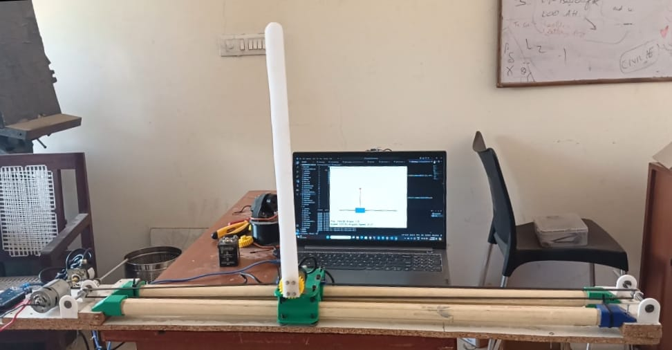
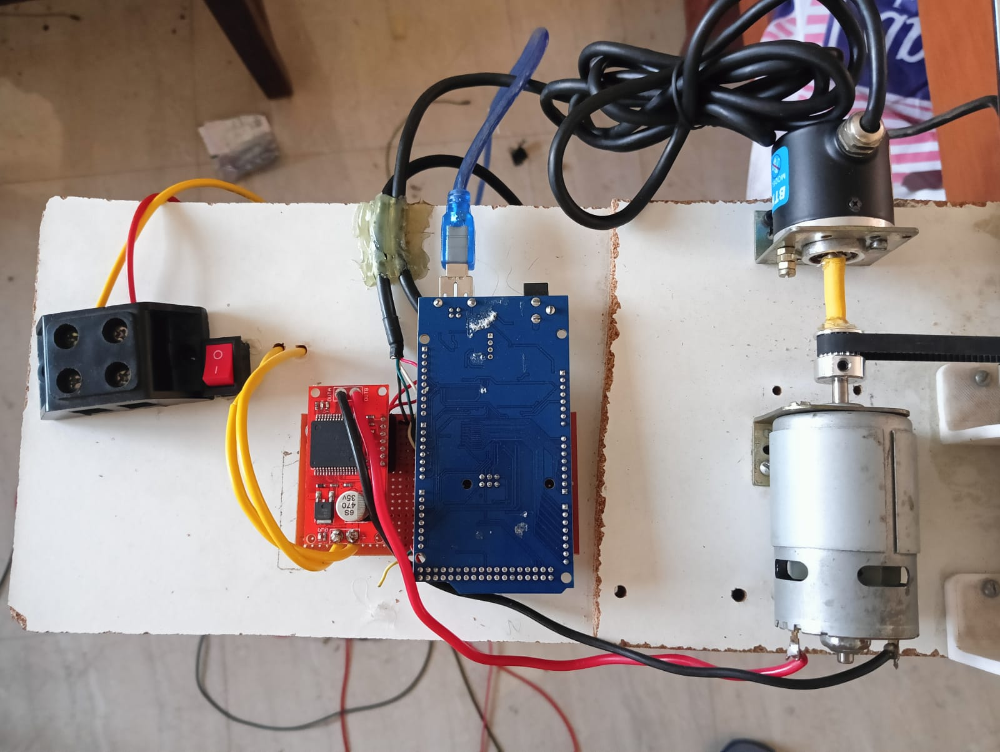

# Inverted Pendulum Project

This project implements a Soft Actor-Critic (SAC) reinforcement learning algorithm with a reward scale based entropy implementation to control a swing up inverted pendulum system. The system includes both software components for the AI agent and visualization, as well as hardware components for the physical pendulum setup.

## Table of Contents
1. [Software Setup](#software-setup)
2. [Usage](#usage)
3. [Hardware](#hardware)
4. [File Descriptions](#file-descriptions)
5. [Manual Mode](#manual-mode)
6. [Troubleshooting](#troubleshooting)

## Software Setup

### Prerequisites
- Python 3.7+
- PyTorch(2.3.1)
- Pygame
- Numpy(1.26.1)
- Matplotlib
- pyserial
- Arduino IDE (for uploading code to the Arduino board)

### Installation
1. Clone this repository:
   ```
   git clone https://github.com/Arbaaz-Tanveer/Inverted-Pendulum-Reinforcement-Learning.git
   cd Inverted-Pendulum-Reinforcement-Learning
   ```

2. Install the required Python packages:
   ```
   pip install torch==2.3.1 pygame numpy==1.26.1 matplotlib pyserial gym 
   ```

3. Connect your Arduino Mega board and update the `arduino_port` in the `InvertedPendulumEnv` class (in `environment.py`) to match your system.

4. Upload the Arduino code:
   - Open the `inverted_pendulum_arduino.ino` file in the Arduino IDE.
   - Select your Arduino Mega board and port in the IDE.
   - Click the "Upload" button to flash the code to your Arduino.

## Usage

1. To run the manual control mode:
   ```
   python environment.py
   ```
   This allows you to manually control the pendulum using the GUI.
   Use the shift button to change between voltage and postion control modes and then type the desired value

2. To train the SAC agent:
   ```
   python main.py
   ```
   Set `load_checkpoint = False` in `main.py` to start a new training session.

3. To run the trained agent:
   ```
   python main.py
   ```
   Ensure `load_checkpoint = True` in `main.py` to use the pre-trained model.

4. Important Note : Make sure that the pendulum is in straight downward position when plugging the arduino and also when running the programs

## Hardware

The physical setup of the inverted pendulum system consists of the following components:

1. Arduino Mega board
2. DC motor(12 V)
3. Motor driver (monster motor shield)
4. Two rotary encoders:
   - One for the rail (cart position)
   - One for the pendulum angle
5. 3D printed parts for the pendulum and cart
6. Linear rail system
7. 12 V contant power supply(SMPS)

### Hardware Details

- **Arduino Mega**: Use of Arduino Mega to accommodate the maximum potential of two encoders. The Mega provides 6 interrupt pins, allowing us to use 4 interrupt pins for the two rotary encoders (2 pins per encoder).

- **Rotary Encoders**:
  - Rail Encoder: Measures the position of the cart on the linear rail.
  - Pendulum Encoder: Measures the angle of the pendulum with a high resolution of 0.25 degrees.

- **Resolution**: The pendulum angle is measured with a precision of 0.25 degrees, providing highly accurate data for the control system.

### Hardware Photos


*Full view of the inverted pendulum setup*


*Close-up of the Arduino Mega and motor driver connections*


The hardware setup allows for precise control and measurement of the pendulum's position and angle. The DC motor moves the cart along the linear rail, while the rotary encoders provide accurate measurements of both the cart's position and the pendulum's angle. The Arduino Mega board interfaces between the hardware and the computer running the reinforcement learning algorithm, utilizing its multiple interrupt pins to read the encoder data efficiently.

## File Descriptions

- `environment.py`: Defines the `InvertedPendulumEnv` class, which handles the pygame visualization and communication with the Arduino.
- `agent_sac.py`: Implements the Soft Actor-Critic agent.
- `networks.py`: Contains the neural network architectures for the actor, critic, and value networks.
- `buffer.py`: Implements the replay buffer for storing experiences.
- `main.py`: The main script for running the training or evaluation of the SAC agent.
- `plotting.py`: Utility functions for plotting learning curves.
- `inverted_pendulum_arduino.ino`: Arduino code for controlling the hardware and communicating with the Python environment. This code is specifically designed for the Arduino Mega and handles reading from two rotary encoders using interrupt pins.

## Manual Mode

The project includes a manual mode for initial troubleshooting and system testing. This mode allows you to directly control the pendulum system without the AI agent, which is useful for verifying hardware connections and system responsiveness.

To use the manual mode:

1. Run the environment script:
   ```
   python environment.py
   ```

2. The PyGame window will open, showing the pendulum visualization.

3. Use the following controls:
   - Click on the input box at the top of the window to activate it.
   - Type a value and press Enter to send a command to the pendulum.
   - Press the Spacebar to toggle between position control mode and voltage control mode.

4. The current mode (Position or Voltage) is displayed in the top right corner of the window.

5. Real-time data (position, angle, speed, and angular speed) is displayed at the bottom of the window.

This manual mode is particularly useful for:
- Verifying that all hardware components are functioning correctly
- Testing the responsiveness of the system
- Calibrating sensors if necessary
- Understanding the system's behavior under different inputs

## Troubleshooting

- **Serial Communication Issues**: Ensure that the correct COM port is specified in the `InvertedPendulumEnv` class. You may need to update the `arduino_port` variable.
- **PyGame Window Not Responding**: Make sure you're running the script with sufficient permissions and that your system supports PyGame.
- **Training Not Converging**: Try adjusting the hyperparameters in the `Agent` class, such as learning rates or network sizes.
- **Hardware Not Responding**: Check all connections between the Arduino Mega, motor driver, and rotary encoders. Ensure that the Arduino code is properly uploaded and configured.
- **Manual Mode Not Working**: Verify that the Arduino is properly connected and the correct port is specified. Check the serial monitor in the Arduino IDE for any error messages.
- **Encoder Reading Issues**: If you're experiencing inaccurate position or angle readings, ensure that the encoder connections to the interrupt pins on the Arduino Mega are correct and secure. Check the Arduino code to verify that the interrupt pins are properly configured.
- **Resolution Problems**: The resoltion depends on the ppr of the encoder,for this project 360 PPR encoder was used for the pendulum which ended up giving 1440 CPR,use of higher ppr encoder will lead to better results.

